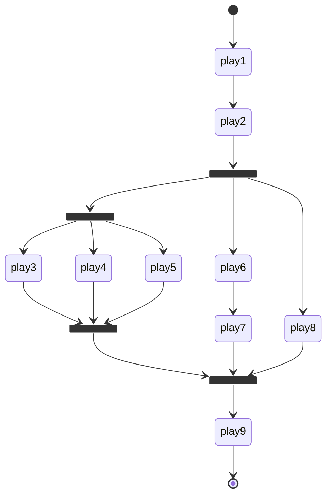

# CDK Ansible by Rust

**This project is in an alpha state.**

- cdk-ansible [![Crates.io][crates-badge-cdk-ansible]][crates-url-cdk-ansible]
- cdk-ansible-cli [![Crates.io][crates-badge-cdk-ansible-cli]][crates-url-cdk-ansible-cli]

[crates-badge-cdk-ansible]: https://img.shields.io/crates/v/cdk-ansible.svg
[crates-url-cdk-ansible]: https://crates.io/crates/cdk-ansible
[crates-badge-cdk-ansible-cli]: https://img.shields.io/crates/v/cdk-ansible-cli.svg
[crates-url-cdk-ansible-cli]: https://crates.io/crates/cdk-ansible-cli

CDK-Ansible is a CDK (Cloud Development Kit) for Ansible, and inspired by AWS CDK.

While Ansible's `playbook` and `inventory` files are written in YAML format, managing YAML templating can be challenging.
CDK-Ansible enables you to generate Ansible files using **Rust** as a type-safe programming language.

WARNING: This project does not use [JSii](https://github.com/aws/jsii).

## Features

- [**cdk-ansible**](https://crates.io/crates/cdk-ansible) can define an abstract Ansible Playbook using Rust.
- [**cdk-ansible-cli**](https://crates.io/crates/cdk-ansible-cli) (`cdk-ansible` command) generates Rust code compatible with existing Ansible modules.

## What can cdk-ansible do?

Full example project can see in [cdk-ansible-examples](https://github.com/pollenjp/cdk-ansible-examples)'s cli-init directory.

Define Ansible **Play** in Rust.

```rust
let play = Box::new(Play {
    name: "sample-play".into(),
    hosts: hosts.into(),
    options: PlayOptions::default(),
    tasks: vec![Task {
        name: "Debug".into(),
        options: TaskOptions::default(),
        command: Box::new(::cdkam::ansible::builtin::debug::Module {
            module: ::cdkam::ansible::builtin::debug::Args {
                options: ::cdkam::ansible::builtin::debug::Opt {
                    msg: OptU::Some("Hello, world!".into()),
                    ..Default::default()
                },
            },
        }),
    }],
}),
```

Create cdk-ansible's Stack and define the relationship between **Play** in Rust (Sequential, Parallel, etc.).

```rust
// let play1, play2, play3, ...

pub struct SampleStack {
    exe_play: ExePlay,
}

impl SampleStack {
    pub fn new(hp: &HostPool) -> Self {
        let hosts = hp.localhost.name.as_str();

        Self {
            exe_play: ExeSequential(vec![
                ExeSingle(Box::new(play1)),
                ExeSingle(Box::new(play2)),
                ExeParallel(vec![
                    ExeParallel(vec![
                        ExeSingle(Box::new(play3)),
                        ExeSingle(Box::new(play4)),
                        ExeSingle(Box::new(play5)),
                    ]),
                    ExeSequential(vec![
                        ExeSingle(Box::new(play6)),
                        ExeSingle(Box::new(play7)),
                    ]),
                    ExeSingle(Box::new(play8)),
                ]),
                ExeSingle(Box::new(play9)),
            ]),
        }
    }
}
```



Instantiate CDK-Ansible's App and add **Inventory** and **Stack** to it.

```rust
pub fn run() -> Result<()> {
    let host_pool = HostPool {
        localhost: LocalHost {
            name: "localhost".into(),
        },
        host_a: Rc::new(HostA {
            name: "host-a".into(),
            fqdn: "host-a.example.com".into(),
        }),
        host_b: RefCell::new(HostB {
            name: "host-b".into(),
            fqdn: "host-b.example.com".into(),
        }),
    };

    let mut app = App::new(std::env::args().collect());
    app.add_inventory(host_pool.to_inventory()?)?;
    app.add_stack(Box::new(SampleStack::new(&host_pool)))?;
    app.run()
}
```

Run your app.

```bash
cargo run --package my-app -- deploy -P 3 -i dev SampleStack
```

If your ansible command is installed through `uv`, pass `--playbook-command` option like below.

<https://github.com/pollenjp/cdk-ansible-examples/blob/a5d5568fa170047fae4b7327b26c5ba16a37f88f/cli-init/xtasks/test/cdk-ansible-cli-init#L33-L40>

## cdk-ansible-cli (cdk-ansible command)

### Install

#### mise

[MISE](https://github.com/jdx/mise) is recommended as it allows you to keep the versions of the cdk-ansible crate and CLI in sync.

```bash
mise use cargo:cdk-ansible-cli
```

#### binstall

[binstall](https://crates.io/crates/cargo-binstall)

```bash
cargo binstall cdk-ansible-cli
```

#### shell

See [the latest release page](https://github.com/pollenjp/cdk-ansible/releases/latest).

#### cargo install

```bash
cargo install cdk-ansible-cli
```

### Requirements

- cdk-ansible-cli
  - rustfmt
    - `rustup component add rustfmt`

## Tutorial

### Init cdk-ansible project

While we plan to provide an init command in the future, for now it is recommended to copy the following sample project.

- <https://github.com/pollenjp/cdk-ansible-examples/tree/main/cli-init>

### Create Ansible Module package for the workspace

Running `cdk-ansible module` command generates a Rust package for the specified Ansible module.

```bash
# '<namespace>.<collection>.<module>' only generates the specified module.
cdk-ansible module --output-dir crates/ --module-name ansible.builtin.debug
```

`cdkam_ansible` in below example is auto-generated by `cdk-ansible module` command.

```text
your-cdk-ansible-app/
|-- Cargo.toml
`-- crates/
    `-- my-app/         ... your app (run `cdk_ansible::App`)
    `-- cdkam_ansible/  ... auto-generated by `cdk-ansible module` command
        |-- Cargo.toml
        `-- src/
            |-- lib.rs
            |-- m/ansible/builtin/debug.rs
            `-- ...
```

`cdk-ansible module` command has other options.

```bash
# '<namespace>.<collection>' generates all modules in the collection.
cdk-ansible module --output-dir crates/ --module-name-regex 'ansible\.builtin\..*'
# '<namespace>' generates all modules in the namespace.
cdk-ansible module --output-dir crates/ --module-name-regex 'ansible\..*'
# If you don't specify `--module-name` or `--module-name-regex`,
# all modules accessible from your ansible environment will be generated.
# (This is the same as `--module-name-regex '*'`)
cdk-ansible module --output-dir crates/

# If you are using uv to manage your ansible project, move to the directory or specify the `--project` option.
uv --project /path/to/your/ansible-project run \
  cdk-ansible module --output-dir crates/ --module-name ansible.builtin.debug
```
