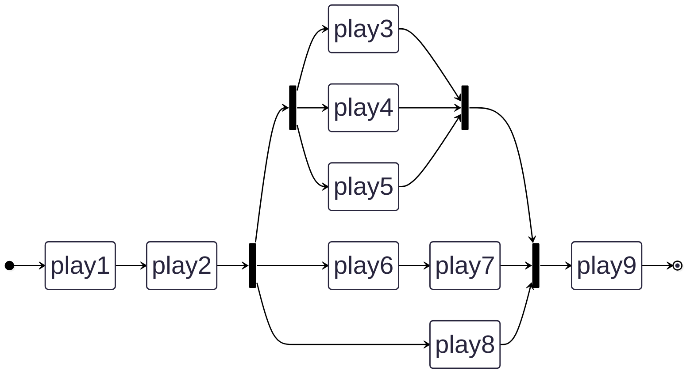
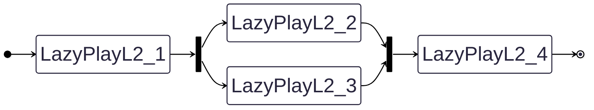
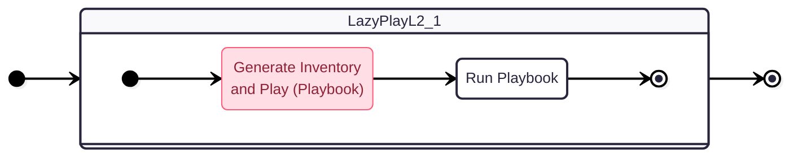

# CDK Ansible by Rust

**This project is in an alpha state.**

- cdk-ansible [![Crates.io][crates-badge-cdk-ansible]][crates-url-cdk-ansible]
- cdk-ansible-cli [![Crates.io][crates-badge-cdk-ansible-cli]][crates-url-cdk-ansible-cli]

[crates-badge-cdk-ansible]: https://img.shields.io/crates/v/cdk-ansible.svg
[crates-url-cdk-ansible]: https://crates.io/crates/cdk-ansible
[crates-badge-cdk-ansible-cli]: https://img.shields.io/crates/v/cdk-ansible-cli.svg
[crates-url-cdk-ansible-cli]: https://crates.io/crates/cdk-ansible-cli

CDK-Ansible is a CDK (Cloud Development Kit) for Ansible, and inspired by AWS CDK.

While Ansible's `playbook` and `inventory` files are written in YAML format, managing YAML templating can be challenging.
CDK-Ansible enables you to generate Ansible files using **Rust** as a type-safe programming language.

WARNING: This project does not use [JSii](https://github.com/aws/jsii).


## Features

- [**cdk-ansible**](https://crates.io/crates/cdk-ansible) can define an abstract Ansible Playbook using Rust.
- [**cdk-ansible-cli**](https://crates.io/crates/cdk-ansible-cli) (`cdk-ansible` command) generates Rust code compatible with existing Ansible modules.

## Version Compatibility

`{cdk-ansible,cdk-ansible-cli}>=0.2.0` compatibility is shown in the table below.

| cdk-ansible | cdk-ansible-cli |
| ----------: | --------------: |
|   `>=0.2.0` |       `>=0.2.0` |

`{cdk-ansible,cdk-ansible-cli}<v0.2.0` are guaranteed to work only with matching versions.

## Quick Start

Template project can see in [cdk-ansible-examples](https://github.com/pollenjp/cdk-ansible-examples) and support [cargo-generate](https://github.com/cargo-generate/cargo-generate).

1. Install [mise](https://github.com/jdx/mise)

2. Install [cargo-generate](https://github.com/cargo-generate/cargo-generate), for example:

   ```bash
   mise use -g rust@latest
   mise use -g cargo-binstall
   mise use -g cargo-generate
   ```

3. Init your project from template and 'Enter' (select default template)

   ```bash
   cargo generate gh:pollenjp/cdk-ansible-examples
   ```

4. Execute the sample command in your local environment.

   ```bash
   # For the command details, refer to `[tasks.run]` in `mise.toml`.
   mise run run
   ```

5. Edit `src/stack/*.rs` and `src/inventory/*.rs` (or `src/inventory.rs`) as you like.

## What can cdk-ansible do?

### Define Plays

Define Ansible **Play** in Rust.

```rust
let play = Box::new(Play {
    name: "sample-play".into(),
    hosts: hosts.into(),
    options: PlayOptions::default(),
    tasks: vec![Task {
        name: "Debug".into(),
        options: TaskOptions::default(),
        command: Box::new(::cdkam::ansible::builtin::debug::Module {
            module: ::cdkam::ansible::builtin::debug::Args {
                options: ::cdkam::ansible::builtin::debug::Opt {
                    msg: OptU::Some("Hello, world!".into()),
                    ..Default::default()
                },
            },
        }),
    }],
}),
```

### Define Stacks (L1 Stack)

Create cdk-ansible's Stack and define the relationship between **Play** (Sequential, Parallel, etc.).

```rust
// let play1, play2, play3, ...

pub struct SampleStack {
    exe_play: ExePlay,
}

impl SampleStack {
    pub fn new(hp: &HostPool) -> Self {
        let hosts = hp.localhost.name.as_str();

        Self {
            exe_play: ExeSequential(vec![
                ExeSingle(Box::new(play1)),
                ExeSingle(Box::new(play2)),
                ExeParallel(vec![
                    ExeParallel(vec![
                        ExeSingle(Box::new(play3)),
                        ExeSingle(Box::new(play4)),
                        ExeSingle(Box::new(play5)),
                    ]),
                    ExeSequential(vec![
                        ExeSingle(Box::new(play6)),
                        ExeSingle(Box::new(play7)),
                    ]),
                    ExeSingle(Box::new(play8)),
                ]),
                ExeSingle(Box::new(play9)),
            ]),
        }
    }
}
```



### Instantiate an App

Instantiate CDK-Ansible's App and add **Inventory** and **Stack** to it.

```rust
pub fn run() -> Result<()> {
    let host_pool = HostPool {
        localhost: LocalHost {
            name: "localhost".into(),
        },
        host_a: Rc::new(HostA {
            name: "host-a".into(),
            fqdn: "host-a.example.com".into(),
        }),
        host_b: RefCell::new(HostB {
            name: "host-b".into(),
            fqdn: "host-b.example.com".into(),
        }),
    };

    let mut app = App::new(std::env::args().collect());
    app.add_inventory(host_pool.to_inventory()?)?;
    app.add_stack(Box::new(SampleStack::new(&host_pool)))?;
    app.run()
}
```

### Run the App

Run your app.

```bash
cargo run --package my-app -- deploy -P 3 -i dev SampleStack
```

If your ansible command is installed through `uv`, pass `--playbook-command` option like below.

<https://github.com/pollenjp/cdk-ansible-examples/blob/a5d5568fa170047fae4b7327b26c5ba16a37f88f/cli-init/xtasks/test/cdk-ansible-cli-init#L33-L40>

### (Optional) L2 Stack

CDK-Ansible can also define higher-level L2 (Layer 2) stacks.
In comparison, the previous Stack is called an L1 Stack.

[simple-sample for L2 Stack](src/bin/l2.rs)

- L1 Stack first statically defines all Inventory and Play objects before moving to the execution phase.
- In contrast, L2 Stack generates Inventory and Play objects just before executing each Play.
- This allows generating Inventory and Play objects based on the execution state up to that point. This functionality can serve as an alternative to Ansible's Dynamic Inventory.





The definition of L2 Stack is similar to L1, but it implements the `StackL2` trait.
The difference is that `fn exe_play` returns `&ExePlayL2`.

```rust
struct SampleStack {
    exe_play: ExePlayL2,
}

impl SampleStack {
    fn new() -> Self {
        Self {
            exe_play: ExePlayL2::Single(Arc::new(SampleLazyPlayL2Helper::new("sample"))),
        }
    }
}

impl StackL2 for SampleStack {
    fn name(&self) -> &str {
        std::any::type_name::<Self>()
            .split("::")
            .last()
            .expect("Failed to get a stack name")
    }
    fn exe_play(&self) -> &ExePlayL2 {
        &self.exe_play
    }
}

pub fn main2() -> Result<()> {
    // AppL2 can define stacks with chainable method calls.
    AppL2::new(std::env::args().collect())
        .stack(Arc::new(SampleStack::new()))
        .expect("Failed to add sample stack")
        .run()
}

```

`ExePlayL2` corresponds to `ExePlay`, but it can accept objects that implement the `LazyPlayL2` trait instead of `Play` objects.
The `LazyPlayL2` trait implements an async function `fn create_play_l2` which can generate information equivalent to an Ansible Play within this function.

```rust
struct SampleLazyPlayL2Helper {
    name: String,
}

impl SampleLazyPlayL2Helper {
    pub fn new(name: &str) -> Self {
        Self {
            name: name.to_string(),
        }
    }
}

impl LazyPlayL2 for SampleLazyPlayL2Helper {
    fn create_play_l2(&self) -> BoxFuture<'static, Result<PlayL2>> {
        let name = self.name.clone();
        async move {
            Ok(PlayL2 {
                name,
                hosts: HostsL2::new(vec![Arc::new(HostA {
                    name: "localhost".to_string(),
                })]),
                options: PlayOptions::default(),
                tasks: create_tasks_helper(2)?,
            })
        }
        .boxed()
    }
}
```

`PlayL2::hosts` is not a simple string, but an object that implements the `HostInventoryVarsGenerator` trait.
This allows you to generate Inventory dynamically based on the execution state up to that point.

```rust
struct HostA {
    name: String,
}

impl HostInventoryVarsGenerator for HostA {
    fn gen_host_vars(&self) -> Result<HostInventoryVars> {
        Ok(HostInventoryVars {
            ansible_host: self.name.clone(),
            inventory_vars: vec![("ansible_connection".to_string(), "local".into())],
        })
    }
}

```

## cdk-ansible-cli (cdk-ansible command)

### Install

#### mise

[MISE](https://github.com/jdx/mise) is recommended as it allows you to keep the versions of the cdk-ansible crate and CLI in sync.

```bash
mise use cargo:cdk-ansible-cli
```

#### binstall

[binstall](https://crates.io/crates/cargo-binstall)

```bash
cargo binstall cdk-ansible-cli
```

#### shell

See [the latest release page](https://github.com/pollenjp/cdk-ansible/releases/latest).

#### cargo install

```bash
cargo install cdk-ansible-cli
```

### Requirements

- cdk-ansible-cli
  - rustfmt
    - `rustup component add rustfmt`

## Tutorial

### Init cdk-ansible project

While we plan to provide an init command in the future, for now it is recommended to copy the following sample project.

- <https://github.com/pollenjp/cdk-ansible-examples/tree/main/cli-init>

### Create Ansible Module package for the workspace

Running `cdk-ansible module` command generates a Rust package for the specified Ansible module.

```bash
# '<namespace>.<collection>.<module>' only generates the specified module.
cdk-ansible module --output-dir crates/ --module-name ansible.builtin.debug
```

`cdkam_ansible` in below example is auto-generated by `cdk-ansible module` command.

```text
your-cdk-ansible-app/
|-- Cargo.toml
`-- crates/
    `-- my-app/         ... your app (run `cdk_ansible::App`)
    `-- cdkam_ansible/  ... auto-generated by `cdk-ansible module` command
        |-- Cargo.toml
        `-- src/
            |-- lib.rs
            |-- m/ansible/builtin/debug.rs
            `-- ...
```

`cdk-ansible module` command has other options.

```bash
# '<namespace>.<collection>' generates all modules in the collection.
cdk-ansible module --output-dir crates/ --module-name-regex 'ansible\.builtin\..*'
# '<namespace>' generates all modules in the namespace.
cdk-ansible module --output-dir crates/ --module-name-regex 'ansible\..*'
# If you don't specify `--module-name` or `--module-name-regex`,
# all modules accessible from your ansible environment will be generated.
# (This is the same as `--module-name-regex '*'`)
cdk-ansible module --output-dir crates/

# If you are using uv to manage your ansible project, move to the directory or specify the `--project` option.
uv --project /path/to/your/ansible-project run \
  cdk-ansible module --output-dir crates/ --module-name ansible.builtin.debug
```
